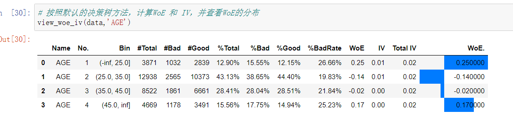

## Author: statfit@hotmail.com
## Version: 0.1.8

### Description 
Westat is a part of pyminer project. 

A package for stat and data miner,calculate woe and iv,and plot woe ,plot iv,calculate ks ,plot ks and auc,plot roc


This is a simple stat package. You can see more from 
[GitHub](https://github.com/stat-fit/westat).
Or 
[PyPI](https://pypi.org/project/westat/).

[pyminer](http://www.pyminer.com).


#### install

```bash
pip install westat
```

#### version
```bash
import westat
westat.version
```

### AUC and KS
<p></p>


<p></p>

### decision tree cut bins
<p></p>



<p></p>


### qcut bins
<p></p>


<p></p>

### custom bins
<p></p>


<p></p>

### Lift
<p></p>


<p></p>

### PSI
<p></p>


<p></p>

### scorecard
<p></p>


<p></p>

### predict
<p></p>


<p></p>