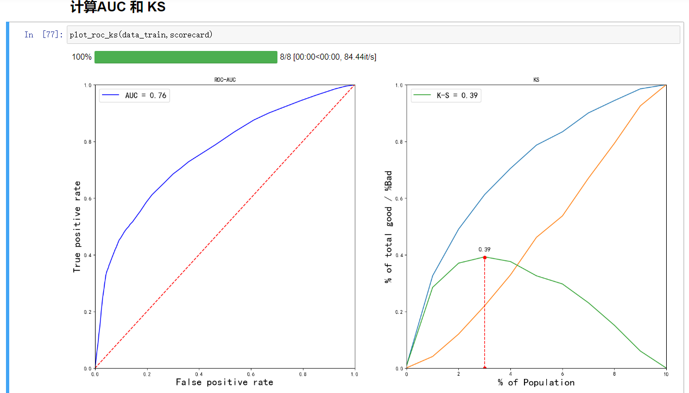

## Author: statfit@hotmail.com
## Version: 0.1.4

### Description 
Westat is a part of pyminer project. 

A package for stat and data miner,calculate woe and iv,and plot woe ,plot iv,calculate ks ,plot ks and auc,plot roc


This is a simple stat package. You can see more from 
[GitHub](https://github.com/stat-fit/westat).
Or 
[PyPI](https://pypi.org/project/westat/).


#### 安装

```bash
pip install westat
```

#### 查看westat版本号
```bash
import westat
westat.version
```

### 计算 AUC 和 KS
<p></p>



<p></p>

### 根据决策树分箱计算WoE和IV
<p></p>


<p></p>


### 等频分箱计算WoE和IV
<p></p>


<p></p>

### 根据切分点计算WoE和IV
<p></p>


<p></p>

### 计算提升度Lift
<p></p>


<p></p>

### 计算稳定性PSI
<p></p>


<p></p>

### 评分卡开发
<p></p>


<p></p>

### 预测模型分数
<p></p>


<p></p>